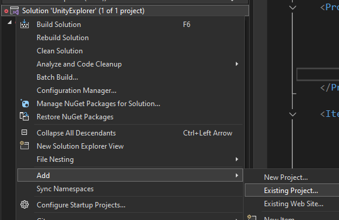
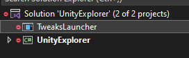
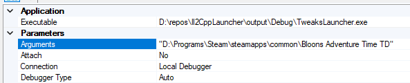

# TweaksLauncher Developer Guide

## Getting started

### In order to build your own mod, you will need:
- Basic C# knowledge
- Some experience with Unity
- A coffee

## Creating your first mod project
### There are 2 ways to create a new mod project:
- Using our dev tools (recommended)
- By creating a new C# Class Library project and referencing all dependencies manually

### Create a mod project using our dev tools
We recommend using this option because it will allow you to enable auto-build (which will automatically build and load new versions of your code). Next to that, all required libraries (including game libraries) will be automatically referenced.<br>
This will automatically put your project in the `Dev` folder, next to the launcher.<br>
For more advanced developers, we recommend this option when creating git repositories, as relative paths to referenced assemblies will be kept for everyone who clones your repository to the `Dev` directory, removing the need to ship your repository will all the game assemblies.

- Run the `CreateMod` batch script (located next to the launcher).
- Follow the instructions displayed on the console.
- You're ready to code!

### Create a mod project manually
If you do not want to store your project in the `Dev` directory, this is the way to go. Keep in mind that there is no auto-build for external projects.

- Create a new Class Library project (targetting .NET 8.0).
- Specify the mod version by giving the assembly a version in your csproj (using the `AssemblyVersion` tag).
- Manually reference `TweaksLauncher.API.dll` and `0harmony.dll` from the `libs` folder. You can find game proxy assemblies in `Games/Your Game Name/Proxies`. Make sure you've ran the game at least once using the launcher.
- Create a new mod class by adding the `TweaksLauncher.IMod` interface to an existing class.
- You're ready to code!

## Coding Your Mod
### Basic Structure
Your main mod class should now look somewhat like this:
```cs
using TweaksLauncher;

namespace MyMod;

public class Main : IMod
{
    public static void Initialize(ModInstance mod)
    {
        ModLogger.Log("Hello World!");
    }
}
```

For now, this will only print `Hello World!` to the console.<br>
- The `Initialize` method is ran when Unity has initialized, which is right before the Unity splash screen is shown.

Sometimes we want to initialize our mod right when when the first game scene is loaded. There are 2 ways to receive a callback when that happens:
- Using the `UnityEvents::FirstSceneLoad` event
- Through our own `MonoBehaviour` (a.k.a. Unity component)

## Events
The `UnityEvents` class provides common Unity events that can be used by mods. Currently, there is only one event, but more might get added in the future.

### FirstSceneLoad
Occurs when the first game scene is loaded.

The following code will print `Hello Game!` to the console once the first game scene is loaded:
```cs
public static void Initialize(ModInstance mod)
{
    UnityEvents.FirstSceneLoad += OnFirstSceneLoad;
}

private static void OnFirstSceneLoad()
{
    ModLogger.Log("Hello Game!");
}
```

## Creating Unity components
Creating Unity components in a mod is as simple as in Unity itself.

To create a new Unity component, derive your class from `MonoBehaviour`. Now you can create instances of your component using Unity's API (for example `new GameObject().AddComponent<MyComponent>()`).

TweaksLauncher provides a `UnitySingleton` attribute, which automatically loads your component once the game starts. The component will stay alive forever, unless manually destroyed.

The following code will print `Hello World!` to the console once the component is loaded:
```cs
using TweaksLauncher;
using UnityEngine;

namespace MyMod;

[UnitySingleton] // This will load the component automatically
public class MyComponent : MonoBehaviour
{
    public void Start()
    {
        ModLogger.Log("Hello World!");
    }
}
```

## Patching Methods with Harmony
Method patching is essencial for mods. It allows you to control the way the game behaves by replacing or adding code to existing game methods.

Harmony is a library that allows just that. Harmony patches can be created through simple attributes. Learn more here: https://harmony.pardeike.net/articles/annotations.html.
- The launcher will automatically apply all the `HarmonyPatch` attributes in your mod. Do NOT apply patches manually using the `PatchAll` method.

Here is an example of a Harmony patch:
```cs
using HarmonyLib;

// In this attribute you need to specify the class of the target method, the target method name, and the target method parameters.
[HarmonyPatch(typeof(ClassOfTheMethodToPatch), "TargetMethodName", [ typeof(int) ])]
private static class Patch
{
    private static void Prefix()
    {
        // The code inside this method will run before 'TargetMethodName' is executed
    }
    
    private static void Postfix()
    {
        // The code inside this method will run after 'TargetMethodName' has executed
    }
}
```

You can also modify the arguments and return values of the method call. Learn more here: https://harmony.pardeike.net/articles/patching-injections.html

## Debugging
### This guide primarily focuses on Visual Studio 2022 and up.

You can easily debug your mod through your IDE. This will allow you to start the game through the IDE, set breakpoints and inspect unhandled exceptions.

- First, you will need to add the launcher's executable as an existing project to your solution.<br>


- Your solution should now look somewhat like this:<br>


- Right click on the `TweaksLauncher` project and `Set as Startup Project`.

- Right click on the project again and go to `Properties`

- Set the `Arguments` property to the path of your game. Make sure to put it between double quotes. Example:<br>


- You're all set! You can now start debugging your mod by simply clicking the `Start` button at the top of your IDE.

## Releasing Your Mod
When releasing a mod, it's important to make it easy for users to install.

First, we need to understand the basic folder structure of TweaksLauncher.
- Each mod should have its own folder, for example: `MyMod/MyMod.dll`
- The mod folder must have the same name as the dll
- All universal mods go to the `GlobalMods` folder. Example path: `TweaksLauncher/GlobalMods/MyMod/MyMod.dll`
- All game-specific mods need to go to the `Games/Your Game Name/Mods` folder. Example path: `TweaksLauncher/Games/BloonsTD6/Mods/MyMod/MyMod.dll`

Knowing this, the best practice is to zip your mod with the same folder structure before releasing it. This will allow the users to easily unzip the mod into the right directory.

Example of a good zip structure:
```
Games
| BloonsTD6
  | Mods
    | MyMod
      | MyMod.dll
      | ExampleDependency.dll
```

TweaksLauncher also support standalone mods, which don't have their own directory, but only a single dll. This isn't recommended, but may look better for smaller mods.

Example of a good zip structure for standalone mods:
```
Games
| BloonsTD6
  | Mods
    | MyStandaloneMod.dll
```